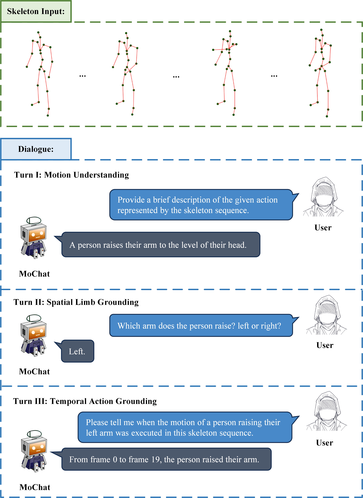

# MoChat: Joints-Grouped Spatio-Temporal Grounding LLM for Multi-Turn Motion Comprehension and Description

Official implementation of "MoChat: Joints-Grouped Spatio-Temporal Grounding LLM for Multi-Turn Motion Comprehension and Description"

## Overview

MoChat is a Multimodal Large Language Model (MLLM) that revolutionizes human motion understanding through precise spatio-temporal grounding. Unlike conventional motion analysis systems, MoChat integrates:
- **Motion Understanding**: Performs fundamental motion comprehension and summarization.
- **Spatial Limb Grounding**: Accurately locates body parts involved in described movements.
- **Temporal Action Grounding**: Precisely identifies time boundaries corresponding to specific motion descriptions.

<div align=center>

</div>

## Installation

```bash
# Clone repository
git clone https://github.com/CSUBioGroup/MoChat.git
cd MoChat

# Create conda environment from spec
conda env create -f environment.yml

# Activate environment
conda activate mochat
```

## Demo

### Step 1: Start the backend service
```bash
CUDA_VISIBLE_DEVICES=0 uvicorn skeleton_demo:app --host 0.0.0.0 --port 7070
```
> **Hardware Requirement**: This demo requires at least **30GB GPU memory**.  

### Step 2: Access the web interface
After the service starts, open your web browser and visit:
```
http://localhost:7070
```
> **For remote servers**: Replace `localhost` with your server IP (e.g., `http://192.168.1.100:7070`)

## Models

We provide the following trained models for download:  
- **[Joints-Grouped Skeleton Encoder](https://huggingface.co/CSUBioGroup/MoChat/tree/main)** for motion sequences representation.  
- Two variants of motion comprehension models:  
  - [MoChat](https://huggingface.co/CSUBioGroup/MoChat/tree/main): Base model. 
  - [MoChat-R](https://huggingface.co/CSUBioGroup/MoChat/tree/main): Extended model with regression head.

## Datasets

MoChat supports the following motion datasets:

- [HumanML3D](https://github.com/EricGuo5513/HumanML3D)
- [KIT-ML](https://drive.google.com/drive/folders/1D3bf2G2o4Hv-Ale26YW18r1Wrh7oIAwK?usp=sharing)

## Acknowledgements

- [Chat-Univi](https://github.com/PKU-YuanGroup/Chat-UniVi): MoChat builds upon the foundational work of Chat-UniVi. Special thanks to the group for making their excellent codebase publicly available.

## License

* The core implementation of MoChat is released under the **Apache License 2.0** as found in the [LICENSE](LICENSE) file.
* The service is a research preview intended for non-commercial use only, subject to the model [License](https://github.com/facebookresearch/llama/blob/main/MODEL_CARD.md) of LLaMA.


## Citation

If you use MoChat in your research, please cite our paper:

```bibtex
@misc{mo2024mochatjointsgroupedspatiotemporalgrounding,
      title={MoChat: Joints-Grouped Spatio-Temporal Grounding LLM for Multi-Turn Motion Comprehension and Description}, 
      author={Jiawei Mo and Yixuan Chen and Rifen Lin and Yongkang Ni and Min Zeng and Xiping Hu and Min Li},
      year={2024},
      eprint={2410.11404},
      archivePrefix={arXiv},
      primaryClass={cs.CV},
      url={https://arxiv.org/abs/2410.11404}, 
}
```